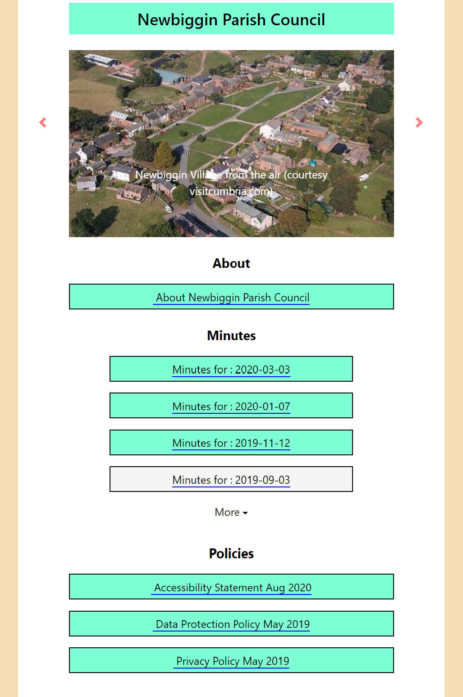
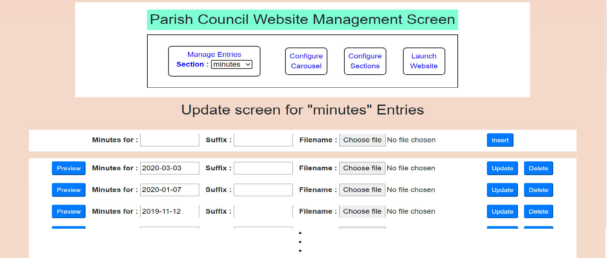

<h2 style = "text-align: center;">A Typical Website</h2>

The image below shows a typical website generated by the parish council system. The system has been installed under a newbigginparishcouncil.co.uk url , configured with newbigginparishcouncil.co.uk/manager.html and then launched by referencing newbgginparishcouncil.co.uk.  A selection of helpful slides hase been inserted into the carousel and then sections have been configured to hold goups of related information as follows: an "About" document detailing the composition and functions of the council, a Minutes section to hold records of recent meetings of the council, and a Policies section.  The selection and specification of the Sections is open-ended and entirely under user-control.  Likewise, there is no limit on the number of Entries that can be created in each section. The sorting order of Entries is fixed (descending alphabetic) but sections thmselves can be configured in any desired sequence. Only the first four entries in a given Section are displayed but a button permits the remainder to be revealed, as required .

 

<h2 style = "text-align: center;">Website Configuration</h2>

Configuration and maintenance of a parishcouncil website is carried out via the sytem's manager.html file. This is accessed by typing its url -  newbigginparishcouncil.com/manager.html in this case - into the browser search fieled. You might find it useful to create a bookmark here.

Once the system has logged you in it will display a screen similar to the one shown below:

 

Configuration facilities are provided for each of the three main elements of the system  - Carousel slides, website Sections and section Entries. 

The Carousel enables you to display a collection of graphic files to give a flavour of your Parish community. The initial github system installation includes a pair of typical graphics so the slide carousel will work from the outset.

Website sections are used to define the filing structure of your website. You can have as many sections as you like and arrange them in whatever sequence you want. The system as installed, includes a Minutes and a Policies section

Website entries define the individual documents referenced by a section - a typical entry would be the pdf file for the minutes for a meeting. Sample Minutes and Policies entries are included in the installation file set.

Additionally, since it's often useful to get the website's view of the state of play while you are in the process of building or editing the configuration, manager.html provides a facility to display the site in a popup window to allow you to perform a quick check. 

<h2>Carousel Maintenance</h2>

Clicking the "Configure Carousel" button reveals the following screen:

 

This screen allows you to change the overall title for the site and to add, delete and update the slides for the carousel. Carousle slide files can be of any graphic format but for artistic and operational effect are probably best standardised to a 16:9 width:height format. Keeping the graphics resolution to reasonable values will also assist site performance - a maximum off 1200 pixels width is probably more than adequate. "Drag and drop" can be used to alter the order of appearance of the slides - just remember to click the "Reorder" button after you've finished dragging and dropping.

<h2>Sections Maintenance</h2>

Clicking the "Configure Sections" button reveals a screen as below. 

 

The Sections configuration screen allows you to create new sections and to update and delete existing ones. Again there is a "reorder" button to allow you to change the order in which sections will be displayed by the website. 

The Insert button requires you to declare a short identification tag for the section. This is used internally for file-naming purposes. You also need to declare a display title for the section's heading on the website. The remaining fields - section prefix and section type - are used to define the way individual entries for the section will be tabulated. Experience show that for a Parish Council application, there are typically two types of entry - entries which reference a date (eg Minutes) and entries that are just characterised by a simple title. The website's reference to an entry for a "date type" section might typically read "Minutes for 2020-07-03". In this case the Section would be defined as "Date Type" and the Section prefix would be set to "Minutes for : ". An Entry for a section defined as "Sundries" might simply read "Area map for Newbiggin Village", in which case the sundries section would be declared as "Standard type" and given a blank Prefix.

Be aware if that while you can create and rename sections without constraint, the system draws a line at you deleting /every/ section. In this event you will find the system  creates a dummy "default" section. If you delete this, it will just create another one, so best rename it as your first section if you're actually just trying to start from scratch with a new set of sections.

ENTRIES maintenance

Once the system is up and running, routine maintenance will just consist of the addition of new Entries and so it is the Entries maintenance screen which provides the initial view of the system. Manager.html remembers the last section you were working on and automatically reutrns to this view on re-entry. If you want to switch to entries-maintenance for a different section, simply select this from the picklist.

For Standard Entry inserts you just need to specify a Title for the entry and select a file for upload. Not that only pdf type files are supported.

For Date Entry inserts, clicking in the title field will reveal a date-picker to allow you to quickly specify the date for the entry in a standard format. For Date Entry inserts you ccan also specify an optionl suffix for each individual entry, so that a Minutes Entry for an AGM might read "Minutes for : 2020-05-06 (AGM)", where the prefix for the section has been specified as "Minutes for : " and the suffix for this particular engtry has been declared as "(AGM)".

GENERAL

DoO be aware that the technical design for the parishcouncil system is extremely simple - deliberately so in order to minimise setup and maintenance complications. In particular there is no database to manage simultaneus operation by numerous updaters. There is no problem with simultaneous retrieval, however, an it is assumed that for a Parish Council system, where, the only updates are likely to come from the Clerk, the design is reasonable. In the unlikely event that the system should malfunction, however, it should be reasonably easy to see where things have gone wrong by insecting the slides and sections configurations text files and examinining the file contents of the Entries folder.

