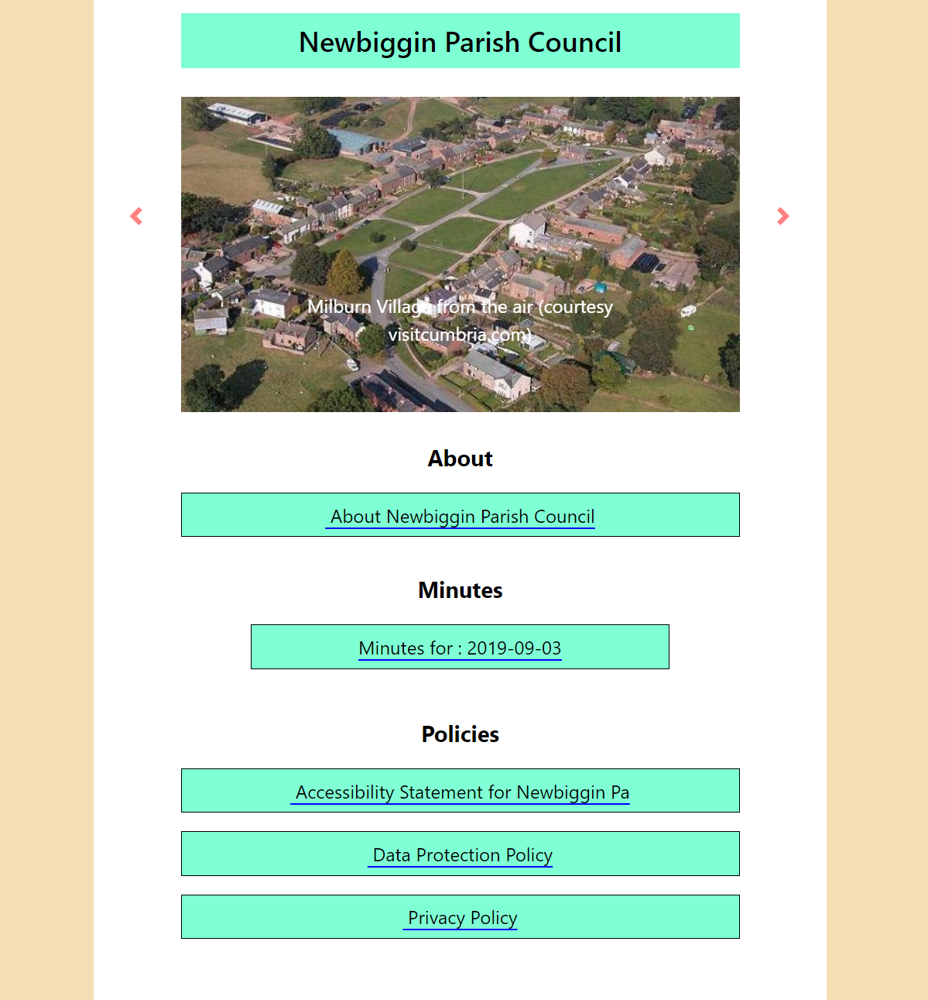
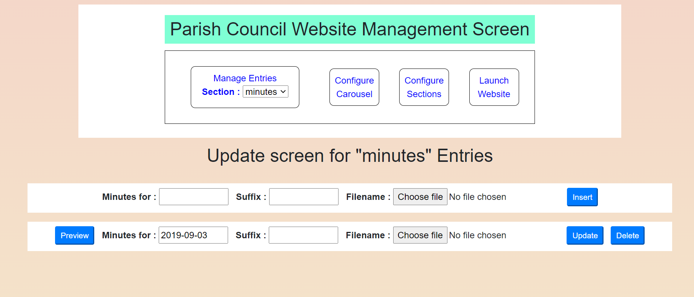

## A Typical *parishcouncil* Website
The image below shows the default website generated by the parish council system immediately after installation. The system has been installed under a myparishcouncil.co.uk url  and the website has been launched by referencing myparishcouncil.co.uk.  The initial website contains a default Carousel and a selection of default Sections.

## Website Configuration
Once the default system is installed, the user is free to tailor the website contents using a "manager" program. This is launched by referencing myparishcouncil.co.uk/manager.html. The manager program enables you to configure the contents of the Carousel, the list of  Sections and the list and content of Entries within them.

The sorting order of Entries is fixed (descending alphabetic) but sections themselves can be configured in any desired sequence. Only the first four entries in a given Section are displayed but a button permits the remainder to be revealed, as required.

The system will start by asking you for a password. If you've not already set a password (see the Configuration guide), you should use the system default of  "newbiggin". Once logged you in you should see a screen as below:

Configuration facilities are provided for each of the three main elements of the system: Carousel slides, website Sections and section Entries. 
The Carousel enables you to display a collection of graphic files that give a flavour of your Parish community. The initial github system installation includes a pair of typical graphics, so the slide carousel will work from the outset.

Website Sections are used to define the filing structure of your website. You can have as many Sections as you like and arrange them in whatever sequence you want. The system as installed, includes an "About", a "Minutes" and a "Policies" section

Website Entries define the individual documents referenced by a section - a typical entry would be the pdf file for the minutes of a meeting. Sample entries for each of the default sections are included in the installation file-set.

Additionally, since it's often useful to get the website's view of the state of play while you are in the process of building or editing the configuration, a facility is provided to display the site in a popup window to allow you to perform a quick check. 
### Carousel Maintenance
Clicking the "Configure Carousel" button reveals the following screen:

This screen allows you to change the overall title for the site and to add, delete and update the slides for the carousel. Carousel slide files can be of any graphic format but for artistic and operational effect are probably best standardised on a 16:9 width:height format. Keeping the graphics resolution to reasonable values will also assist site performance - a maximum of 1200 pixels width is probably more than adequate. "Drag and drop" can be used to alter the order of appearance of the slides - just remember to click the "Reorder" button after you've finished dragging and dropping.
### Sections Maintenance
Clicking the "Configure Sections" button reveals a screen as below. 

The Sections configuration screen allows you to create new sections and to update and delete existing ones. Again there is a "reorder" button to allow you to change the order in which sections will be displayed by the website. 

The Insert button requires you to declare a short identification tag for the section. This is used internally for file-naming purposes. You also need to declare a display title for the section's heading on the website. The remaining fields - section prefix and section type - are used to define the way individual entries for the section will be tabulated. Experience shows that for a Parish Council application, there are typically two types of entry - entries which reference a date (eg Minutes) and entries that are just characterised by a simple title. The website's reference to an entry for a "date type" section might typically read "Minutes for 2020-07-03". In this case, the Section would have been defined as "Date Type" and the Section prefix would have been set to "Minutes for : ". An Entry for a section defined as "Sundries" might simply read "Area map for Newbiggin Village", in which case the sundries section would have been declared as "Standard type" and given a blank Prefix.

Be aware if that while you can create and rename sections without constraint, the system draws a line at letting you delete **every** section. In this event, you will find that the system creates a dummy "default" section. If you delete this, it will just create another one, so if you're trying to replace the default set of sections with a completely new set, it might be better to try "renaming" rather than "deleting" to clear the unwanted sections.
### Entries Maintenance
Clicking the "Manage Entries" button reveals the screen below. 

Once the system is up and running, routine maintenance will just consist of the addition of new Entries and so it is the Entries maintenance screen that provides the initial view of the system. Manager.html remembers the last section you were working on and automatically returns to this view on re-entry. To switch to maintenance for a different section, simply select this from the picklist.

For Standard Entry inserts you just need to specify a Title for the entry and select a file for upload. Note that only pdf type files are supported here -they are in any case the most flexible and effective way of communicating information online. Modern browsers all provide built-in support for pdf files and pdf-displays are zoomable.

For Date Entry inserts, clicking in the title field will reveal a date-picker to allow you to quickly specify the date for the entry in a standard format. For Date Entry inserts you can also specify an optional suffix for each individual entry, so that the Minutes Entry for an AGM, for example,  might read "Minutes for : 2020-05-06 (AGM)". In this case, the prefix for the section has been specified as "Minutes for : " and the suffix for this particular entry has been declared as "(AGM)".
### General
Please note that in order to simplify the initial installation task, manager.html declines to use the sort of database technology required to support high-volume real-time operation by simultaneous users. This is hardly likely to be a concern for Parish Council operations, since the only updates are likely to come from the Clerk, but you should be aware of the system's limitations. In the unlikely event that the system should ever malfunction, inspection of the slides and sections configurations text files in the Configurations folder, and the contents of the Entries folder used to store the system's copies of uploaded files should reveal the problem. Simple editing and renaming should fix things - refer back to the installation software for examples of what the file formats **should** look like.

Be aware that servers usually impose a timeout period on login sessions (typically 20 minutes). If you leave a session unattended for longer than the timeout  period, you will be asked you to login again before you can continue.
